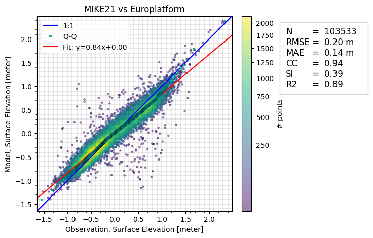

# Hydrodynamic model of the Southern North Sea
This README file contains practical information and background information on the data. The dataset can be cited as:

> DHI. (2024). Hydrodynamic model of the Southern North Sea: MIKE21 model setup, outputs and observation data (1.0) [Data set]. Zenodo. [https://doi.org/10.XX/zenodo.XX](https://doi.org/10.XX/zenodo.XX)

See the [license](license.txt) for information on using the data.

#### Disclaimer:
*The included MIKE21 model setup is a simplified version of the operational setup provided for the Dutch authorities (RVO) in connection with the building of windfarms, but the simplified model performance does not in reflect the quality of the operational setup. Rather, it is a simple demonstration for educational and research purposes. It is not optimized for precision or exhaustive calibration and should not be regarded as a benchmark for best practices in hydrodynamic modeling. The results should not be used for operational or decision-making purposes.*

## Intended use

The dataset is aimed at supporting educational, research, and exploratory activities, such as:

* Experimenting with coastal and ocean modeling using MIKE 21.
* Validating hydrodynamic model outputs with observational data.
* Developing methods for automatically calibrating model parameters.
* Building data-driven models, including machine learning surrogates of the MIKE simulation results.

## Folder structure

The repository is organized in the following way

- README.md
- license
- model
    + MIKE model setup file (.m21fm)
    + log file (.log)
- input
    + meteorological forcing (wind, air pressure)
    + lateral boundary conditions (water level and currents)
    + mesh file (.mesh)
- observations
    + csv files containing observational data for model validation
- code
    + Jupyter notebooks exploring the dataset
    + Jupyter notebooks for model validation using observations
    + a requirements file (.txt)
- figures
    + figures generated by notebooks
- output_sample
    + a reduced MIKE model result data file (.dfsu and .dfs0)

Separately from the current repository, you can find the output zip file (in Zenodo):

- output
    + MIKE model result data (.dfsu and .dfs0)

## Introduction

This folder contains data for a simulation with the MIKE 21 Flow Model FM in the Southern part of the North Sea. The area covers the waters from the English channel, along the Southeast English coast, part of the coast in North of France, the coast of Belgium, the Netherlands, Northwest Germany and Southwest of Denmark. The model setup and results of this repository is a downscaled and simplified version of the work performed by DHI for the Rijksdienst voor Ondernemend Nederland (RVO), where DHI offers predictions of metocean conditions in the UJmuiden Ver (IJB) Offshore Wind Farm Zone. You can read more about the work in the [blogpost here](https://www.dhigroup.com/projects/supporting-successful-dutch-offshore-wind-power-development) or the [scientific report](https://offshorewind.rvo.nl/file/download/bfa49f34-f894-4562-882f-eb1a8b7497e9/ijv_20231222-dhi-metocean-modelling.pdf).

This repository contains the setup file, input data and observation data, as well as simulation result data. The simulation result data is available in Zenodo. The data supplied in this repository covers the period from 2022-01-01 to 2023-12-31. There is a spin-up period, so it is recommended to remove the first 2 days of the result data. 

## The MIKE 21 Flow Model FM

MIKE 21 Flow Model FM is a modelling system based on a flexible mesh approach. The modelling system has been developed for applications within oceanographic, coastal and estuarine environments. The model is based on the numerical solution of the two-dimensional shallow water equations - the depth-integrated incompressible Reynolds averaged Navier-Stokes equations. More information can be found [in the documentation](https://manuals.mikepoweredbydhi.help/latest/Coast_and_Sea/MIKE_FM_HD_2D.pdf).

The mesh consists of triangular elements in a higher resolution in the areas of interest, and for each node a depth value is assigned by interpolating the bathymetry data. The mesh is shown in the figure below. It consists of a total of around 8000 elements covering the area of approximately 24.000 $km^2$.

A simulation can be performed with the [MIKE modelling software](https://www.dhigroup.com/technologies/mikepoweredbydhi), while supplying the following data for driving the model:

- the water levels and current velocities on the North boundary
- the water levels and current velocities on the South boundary
- wind velocities and air pressure in the domain.

This input data can be found in the [/input](/input) folder. Model parameters, e.g. bed resistance constant, can be calibrated by comparing the model simulations to observational data. 

The outputs of the model are given as a timeseries for each mesh element on the spatial domain containing the variables:
- the surface elevation,
- the u and v components of the current velocity.

This data can be found as a separate file in [Zenodo](https://doi.org/10.XXX/zenodo.XXX). Once a simulation has been run, a log file will be generated. The log-file for the benchmark simulation is found in the folder [/model](/model), and it contains information on the parameters used and the time spent on the simulation. 

Since all data, including output from a simulation, is given, it is not necessary to run the MIKE simulation. However, it is possible, since a setup file is supplied as well as all of the input data. Running the MIKE software requires a license. Read more about [obtaining a license](https://www.dhigroup.com/technologies/mikepoweredbydhi/pricing) and about [academic licensing](https://www.dhigroup.com/technologies/mikepoweredbydhi/pricing/academic-licenses). If you already have a license, read the [step-by-step guide](https://manuals.mikepoweredbydhi.help/latest/Coast_and_Sea/MIKE_FM_HD_Step_By_Step.pdf) to learn how to run simulations.

The input and output data are given as dfs files. These files can be processed using the MIKE IO Python package developed by DHI. Find more information on the data types in the [MIKE IO documentation](https://dhi.github.io/mikeio/).

## Model validation

The [ModelSkill Python package](https://dhi.github.io/modelskill/) developed at DHI can be used for validating the model outputs by comparing to observational data. 

The model is validated by comparison to observational data from measurement stations in Øresund and altimetry data from satellites. This is done in the notebooks code/model_validation_*.ipynb. The leftmost figure below shows the location of the measurement stations, and the rightmost figure shows the coverage of the altimetry data.

Below, the comparison between the observational data from one such measurement station and MIKE 21 is shown first followed by the comparison to the altimetry data. The production of these and many more plots is found in the notebooks code/model_validation_*.ipynb.

## Data sources

Several data sources contribute to this case. They are outlined below. 

The following changes have been made to the data:

- Water level observations: Data has been filtered to only include "good" data points according to quality flags. Data is centered around zero (subtraction of mean) and a rolling average is calculated for intervals of 30 minutes. The time-index is converted to UTC. The lon/lat coordinates are calculated as a mean value of the observed, since the buoys are drifting slightly. 
- Altimetry data: Data has been filtered to only include "good" data points according to quality flags. 

| Data   | Source|  Citation | License | 
| -------- | ------- | ------- | ------- |
| Mesh | The mesh is developed by DHI. | Repository citation, see [the top](#Hydrodynamic-model-of-the-Southern-North-Sea) | [CC BY-NC 4.0](https://creativecommons.org/licenses/by/4.0/) |
| Bathymetry | The bathymetry is based on:   1: the EMODnet Bathymetry Digital Terrain Model (DTM) 2020.   2: Rijkswaterstaat’s bathymetric measurements along the Dutch coasts   3: FUGRO’s bathymetric measurements at the HKZ, HKN and HKW wind farm zones   4: MMT SWEDEN AB’s bathymetric survey for the TNW wind farm zone   5: GEOxyz’s bathymetric survey of IJmuiden Ver wind farm zone (alpha and beta)   6: FUGRO’s bathymetric survey of IJmuiden Ver Wind Farm Zone (gamma).  The bathymetry data is interpolated onto the mesh. | 1: EMODnet Bathymetry Consortium (2020). EMODnet Digital Bathymetry (DTM 2020).EMODnet Bathymetry Consortium [https://doi.org/10.12770/bb6a87dd-e579-4036-abe1-e649cea9881a](https://doi.org/10.12770/bb6a87dd-e579-4036-abe1-e649cea9881a)  For the rest, more information can be found in: DHI, "Metocean Assessment Modelling Report, IJmuiden Ver Wind Farm Zone", Dec 2023, URL: [https://offshorewind.rvo.nl/file/download/bfa49f34-f894-4562-882f-eb1a8b7497e9/ijv_20231222-dhi-metocean-modelling.pdf](https://offshorewind.rvo.nl/file/download/bfa49f34-f894-4562-882f-eb1a8b7497e9/ijv_20231222-dhi-metocean-modelling.pdf) (accessed: 2024-11-13) | The data has been interpolated to the mesh resolution such that the original resolution is no longer represented nor reproduceable from the attached mesh. Hence, the mesh with the depth estimates is shared under the same licence as the rest of this repository, namely [CC BY-NC 4.0](https://creativecommons.org/licenses/by-nc/4.0/deed.en). |
| Wind and Air pressure | A subsampled version of the high-resolution ERA5+Weather Research & Forecasting model (WRF) data used for the [RVO project](https://offshorewind.rvo.nl/file/download/bfa49f34-f894-4562-882f-eb1a8b7497e9/ijv_20231222-dhi-metocean-modelling.pdf). The data is subsampled in space to 16km and temporally to hourly data.  | Repository citation, see [the top](#Hydrodynamic-model-of-the-Southern-North-Sea). | Only non-commercial use: [CC BY-NC 4.0](https://creativecommons.org/licenses/by-nc/4.0/deed.en). |
| Boundary condition | A subsampled version of the high-resolution data from a regional model used for the [RVO project](https://offshorewind.rvo.nl/file/download/bfa49f34-f894-4562-882f-eb1a8b7497e9/ijv_20231222-dhi-metocean-modelling.pdf). The data is subsampled to 16 spatial points on the North boundary and 9 points in the South.  | Original citation: DHI, "DHI North Europe Hydrodynamic Model forced with ERA5 Validation Report," 2023. For citing the subsampled data, cite this repository, see [the top](#Hydrodynamic-model-of-the-Southern-North-Sea).  | Only non-commercial use: [CC BY-NC 4.0](https://creativecommons.org/licenses/by-nc/4.0/deed.en). |
| Sea levels in measurement stations | Data from the stations K13a, J61, F3 platform and Europlatform is retrieved through the [Copernicus Marine Service (CMEMS, or Copernicus Marine Environmental Monitoring Service)](https://www.copernicus.eu/en/copernicus-services/marine). More specifically, the open download service dashboard, which can be found [here](https://marineinsitu.eu/dashboard/). The data from the three other stations has been retrieved from the Netherlands Enterprise Agency through the websites: [IJVA](https://offshorewind.rvo.nl/page/view/4c4cb8e3-a1c7-404f-917f-a2f6e0d8c803/wind-en-water-ijmuiden-ver), [DDW1A](https://offshorewind.rvo.nl/page/view/ac0e26d7-1943-417f-b0f8-6fc3452595c1/wind-en-water-doordewind) and [NWA](https://offshorewind.rvo.nl/page/view/500ae8a0-e3bc-467f-81fe-9196fe42413a/wind-en-water-nederwiek).  | Copernicus Marine Service, "Atlantic- European North West Shelf- Ocean In-Situ Near Real Time observations" (2024), [https://doi.org/10.48670/moi-00045](https://doi.org/10.48670/moi-00045). | See full license [here](https://marine.copernicus.eu/user-corner/service-commitments-and-licence). Excerpt: "The Licensee is hereby granted a worldwide, non exclusive, royalty free, perpetual licence, (subject to the terms and conditions of this agreement) to: (a) make and use such reasonable copies of Copernicus Marine Service Products for internal use and back up purposes; (b) modify, adapt, develop, create and distribute Value Added Products or Derivative Work from Copernicus Marine Service Products for any purpose; (c) redistribute, disseminate any Copernicus Marine Service Product in their original form via any media." |

### Altimetry data

The altimetry data is extracted from a range of different sources. The data is based on satellite observations, and the data is downloaded using [DHI's services for marine observation data](https://altimetry.dhigroup.com/). Data sources:

| Satellite name    | Owner|  Link |
| -------- | ------- | ------- |
| Sentinel-3A (3a) | European Space Agency (ESA) |  [https://sentiwiki.copernicus.eu/web/s3-altimetry-instruments](https://sentiwiki.copernicus.eu/web/s3-altimetry-instruments) |
| Sentinel-3B (3b) | European Space Agency (ESA) | [https://sentiwiki.copernicus.eu/web/s3-altimetry-instruments](https://sentiwiki.copernicus.eu/web/s3-altimetry-instruments) |
| Sentinel-6A (6a) | European commission, ESA, EUMETSAT, NASA and NOAA |  [https://sentinels.copernicus.eu/web/sentinel/missions/sentinel-6/data-products](https://sentinels.copernicus.eu/web/sentinel/missions/sentinel-6/data-products) |
| CryoSat-2 (c2) | European Space Agency (ESA) |  [https://earth.esa.int/eogateway/catalog/cryosat-products](https://earth.esa.int/eogateway/catalog/cryosat-products)  |
| SARAL (sa) | French National Space Agency (CNES) and Indian Space Research Organisation (ISRO) | [https://podaac.jpl.nasa.gov/dataset/ALTIKA_SARAL_L2_OST_XOGDR](https://podaac.jpl.nasa.gov/dataset/ALTIKA_SARAL_L2_OST_XOGDR) |
| Jason-3 (j3) | NASA, CNES, EUMETSAT, NOAA | [https://sealevel.jpl.nasa.gov/missions/jason-3/summary/](https://sealevel.jpl.nasa.gov/missions/jason-3/summary/) |
