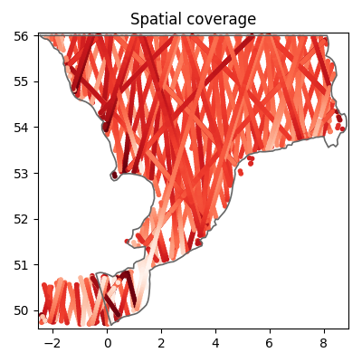

# Hydrodynamic model of Øresund
This README file contains practical information and background information on the data. The dataset can be cited as:

> DHI. (2024). Hydrodynamic model of Øresund: MIKE21 model setup, outputs and observation data (1.0) [Data set]. Zenodo. [https://doi.org/10.5281/zenodo.14160710](https://doi.org/10.5281/zenodo.14160710)

See the [license](license.txt) for information on using the data.

#### Disclaimer:
*The included MIKE21 model setup is designed as a simple demonstration for educational and research purposes. It is not optimized for precision or exhaustive calibration and should not be regarded as a benchmark for best practices in hydrodynamic modeling. The results should not be used for operational or decision-making purposes.*

## Intended use

The dataset is aimed at supporting educational, research, and exploratory activities, such as:

* Experimenting with coastal and ocean modeling using MIKE 21.
* Validating hydrodynamic model outputs with observational data.
* Developing methods for automatically calibrating model parameters.
* Building data-driven models, including machine learning surrogates of the MIKE simulation results.

## Folder structure

The repository is organized in the following way

- README.md
- license
- model
    + MIKE model setup file (.m21fm)
    + log file (.log)
- input
    + meteorological forcing (wind, air pressure)
    + lateral boundary conditions (water level and currents)
    + mesh file (.mesh)
- observations
    + csv files containing observational data for model validation
- code
    + Jupyter notebooks exploring the dataset
    + Jupyter notebooks for model validation using observations
    + a requirements file (.txt)
- figures
    + figures generated by notebooks
- output_sample
    + a reduced MIKE model result data file (.dfsu and .dfs0)

Separately from the current repository, you can find the output zip file (in Zenodo):

- output
    + MIKE model result data (.dfsu and .dfs0)

## Introduction

This folder contains data for a simulation with the MIKE 21 Flow Model FM in the Øresund Strait between Denmark and Sweden. The solution is primarily driven by the surge component introduced at the two open boundaries (one in North and one in South). The meteorological forcings such as air pressure and wind have only a minor effect on the result. The tidal range of the area is 10-20 cm. 

This repository contains the setup file, input data and observation data, as well as simulation result data. The simulation result data is available in Zenodo. The data supplied in this repository covers the period from 2014-01-01 to 2023-12-31. There is a spin-up period, so it is recommended to remove the first 2 days of the result data. 

## The MIKE 21 Flow Model FM

MIKE 21 Flow Model FM is a modelling system based on a flexible mesh approach. The modelling system has been developed for applications within oceanographic, coastal and estuarine environments. The model is based on the numerical solution of the two-dimensional shallow water equations - the depth-integrated incompressible Reynolds averaged Navier-Stokes equations. More information can be found [in the documentation](https://manuals.mikepoweredbydhi.help/latest/Coast_and_Sea/MIKE_FM_HD_2D.pdf).

The Øresund mesh consists of triangular elements in a higher resolution close to the coast than on deeper waters, and for each node a depth value is assigned by interpolating the EMODnet bathymetry data. The mesh is shown in the figure below. It consists of a total of 3320 elements covering the area of approximately 2000 $km^2$.

A simulation can be performed with the [MIKE modelling software](https://www.dhigroup.com/technologies/mikepoweredbydhi), while supplying the following data for driving the model:

- the water levels and current velocities on the North boundary
- the water levels and current velocities on the South boundary
- wind velocities and air pressure in the domain.

This input data can be found in the [/input](/input) folder. Model parameters, e.g. bed resistance constant, can be calibrated by comparing the model simulations to observational data. 

The outputs of the model are given as a timeseries for each mesh element on the spatial domain containing the variables:
- the surface elevation,
- the u and v components of the current velocity.

This data can be found as a separate file in [Zenodo](https://doi.org/10.5281/zenodo.14160710). Once a simulation has been run, a log file will be generated. The log-file for the benchmark simulation is found in the folder [/model](/model), and it contains information on the parameters used and the time spent on the simulation. 

Since all data, including output from a simulation, is given, it is not necessary to run the MIKE simulation. However, it is possible, since a setup file is supplied as well as all of the input data. Running the MIKE software requires a license. Read more about [obtaining a license](https://www.dhigroup.com/technologies/mikepoweredbydhi/pricing) and about [academic licensing](https://www.dhigroup.com/technologies/mikepoweredbydhi/pricing/academic-licenses). If you already have a license, read the [step-by-step guide](https://manuals.mikepoweredbydhi.help/latest/Coast_and_Sea/MIKE_FM_HD_Step_By_Step.pdf) to learn how to run simulations.

The input and output data are given as dfs files. These files can be processed using the MIKE IO Python package developed by DHI. Find more information on the data types in the [MIKE IO documentation](https://dhi.github.io/mikeio/).

## Model validation

The [ModelSkill Python package](https://dhi.github.io/modelskill/) developed at DHI can be used for validating the model outputs by comparing to observational data. 

The model is validated by comparison to observational data from measurement stations in Øresund and altimetry data from satellites. This is done in the notebooks code/model_validation_*.ipynb. The leftmost figure below shows the location of the measurement stations, and the rightmost figure shows the coverage of the altimetry data.

Below, the comparison between the observational data from one such measurement station and MIKE 21 is shown first followed by the comparison to the altimetry data. The production of these and many more plots is found in the notebooks code/model_validation_*.ipynb.

## Data sources

Several data sources contribute to this case. They are outlined below. 

The following changes have been made to the data:

- Sea levels in measurement stations: Data has been filtered to only include "good" or "probably good" data points according to quality flags. The coordinates of some stations have been moved into the simulation domain, since they are sometimes located so close to land (e.g. in a harbor) that the mesh is not covering it. 
- Current velocities in measurement stations: Data has been filtered to only include "good" or "probably good" data points according to quality flags. Some faulty observations have been removed manually (e.g. zero-values and outliers). The u and v components of the current velocities are calculated from the speed and directions. The data is given at different depths, so depth-averaged values have been calculated. 
- Altimetry data: Data has been filtered to only include "good" data points according to quality flags. 

| Data   | Source|  Citation | License | 
| -------- | ------- | ------- | ------- |
| Mesh | The mesh is developed by DHI. | Repository citation, see [the top](#Hydrodynamical-model-of-Øresund) | [CC BY 4.0](https://creativecommons.org/licenses/by/4.0/) |
| Bathymetry | The bathymetry is based on the EMODnet Bathymetry Digital Terrain Model (DTM) 2020. | EMODnet Bathymetry Consortium (2020). EMODnet Digital Bathymetry (DTM 2020).EMODnet Bathymetry Consortium [https://doi.org/10.12770/bb6a87dd-e579-4036-abe1-e649cea9881a](https://doi.org/10.12770/bb6a87dd-e579-4036-abe1-e649cea9881a) | [CC BY 4.0](https://creativecommons.org/licenses/by/4.0/) |
| Wind and Air pressure | The ERA5 reanalysis of globate climate. Produced by Copernicus Climate Change Service at ECMWF. | Hersbach, H., Bell, B., Berrisford, P., Biavati, G., Horányi, A., Muñoz Sabater, J., Nicolas, J., Peubey, C., Radu, R., Rozum, I., Schepers, D., Simmons, A., Soci, C., Dee, D., Thépaut, J-N. (2023): ERA5 hourly data on pressure levels from 1940 to present. Copernicus Climate Change Service (C3S) Climate Data Store (CDS), DOI: 10.24381/cds.bd0915c6 (Accessed on 19-12-2023) | See full license [here](https://apps.ecmwf.int/datasets/licences/copernicus/). Excerpt: "Access to Copernicus Products is given for any purpose in so far as it is lawful, whereas use may include, but is not limited to: reproduction; distribution; communication to the public; adaptation, modification and combination with other data and information; or any combination of the foregoing." |
| Boundary condition | The boundary condition input is obtained from DHI's Danish Waters and Baltic Sea (DKBS) model, which is a 3-dimensional hydrodynamic model. | DHI, ”Water levels and currents on the boundaries of Øresund from the DKBS hydrodynamical model” (2024). | [CC BY 4.0](https://creativecommons.org/licenses/by/4.0/) |
| Sea levels in measurement stations | Retrieved through the [Copernicus Marine Service (CMEMS, or Copernicus Marine Environmental Monitoring Service)](https://www.copernicus.eu/en/copernicus-services/marine). More specifically, the open download service from the Marine Data Store is used. It can be found [here](https://data.marine.copernicus.eu/product/INSITU_BAL_PHYBGCWAV_DISCRETE_MYNRT_013_032/download?dataset=cmems_obs-ins_bal_phybgcwav_mynrt_na_irr_202311--ext--history). | Copernicus Marine Service, "Baltic Sea- In Situ Near Real Time Observations" (2024), [https://doi.org/10.48670/moi-00032](https://doi.org/10.48670/moi-00032). | See full license [here](https://marine.copernicus.eu/user-corner/service-commitments-and-licence). Excerpt: "The Licensee is hereby granted a worldwide, non exclusive, royalty free, perpetual licence, (subject to the terms and conditions of this agreement) to: (a) make and use such reasonable copies of Copernicus Marine Service Products for internal use and back up purposes; (b) modify, adapt, develop, create and distribute Value Added Products or Derivative Work from Copernicus Marine Service Products for any purpose; (c) redistribute, disseminate any Copernicus Marine Service Product in their original form via any media." |
| Current velocities in measurement stations | Retrieved from SMHI (Meteorological and Hydrological Institute of Sweden). The data is subsampled using a rolling median to get half hour observations, and then the u and v components are calculated from the speed and directions. | Meteorological and Hydrological Institute of Sweden, "Oceanographic observations" (2024), URL: [https://www.smhi.se/en/services/open-data/oceanographic-observations](https://www.smhi.se/en/services/open-data/oceanographic-observations) (accessed: 2024-11-18) | [CC BY 4.0 license](https://creativecommons.org/licenses/by/4.0/legalcode.en) |

### Altimetry data

The altimetry data is extracted from a range of different sources. The data is based on satellite observations, and the data is downloaded using [DHI's services for marine observation data](https://altimetry.dhigroup.com/). Data sources:

| Satellite name    | Owner|  Link |
| -------- | ------- | ------- |
| Sentinel-3A (3a) | European Space Agency (ESA) |  [https://sentiwiki.copernicus.eu/web/s3-altimetry-instruments](https://sentiwiki.copernicus.eu/web/s3-altimetry-instruments) |
| Sentinel-3B (3b) | European Space Agency (ESA) | [https://sentiwiki.copernicus.eu/web/s3-altimetry-instruments](https://sentiwiki.copernicus.eu/web/s3-altimetry-instruments) |
| Sentinel-6A (6a) | European commission, ESA, EUMETSAT, NASA and NOAA |  [https://sentinels.copernicus.eu/web/sentinel/missions/sentinel-6/data-products](https://sentinels.copernicus.eu/web/sentinel/missions/sentinel-6/data-products) |
| CryoSat-2 (c2) | European Space Agency (ESA) |  [https://earth.esa.int/eogateway/catalog/cryosat-products](https://earth.esa.int/eogateway/catalog/cryosat-products)  |
| SARAL (sa) | French National Space Agency (CNES) and Indian Space Research Organisation (ISRO) | [https://podaac.jpl.nasa.gov/dataset/ALTIKA_SARAL_L2_OST_XOGDR](https://podaac.jpl.nasa.gov/dataset/ALTIKA_SARAL_L2_OST_XOGDR) |
| Jason-2 (j2) | National Aeronautics and Space Administration (NASA) and French National Space Agency (CNES) | [https://podaac.jpl.nasa.gov/OSTM-JASON2](https://podaac.jpl.nasa.gov/OSTM-JASON2) |
